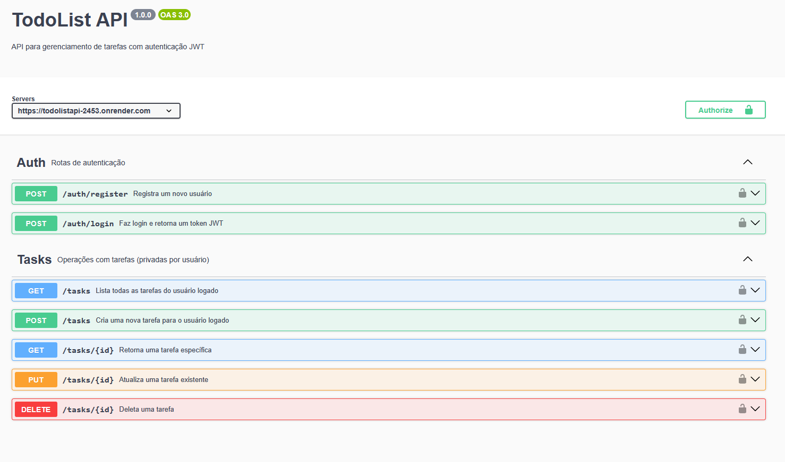
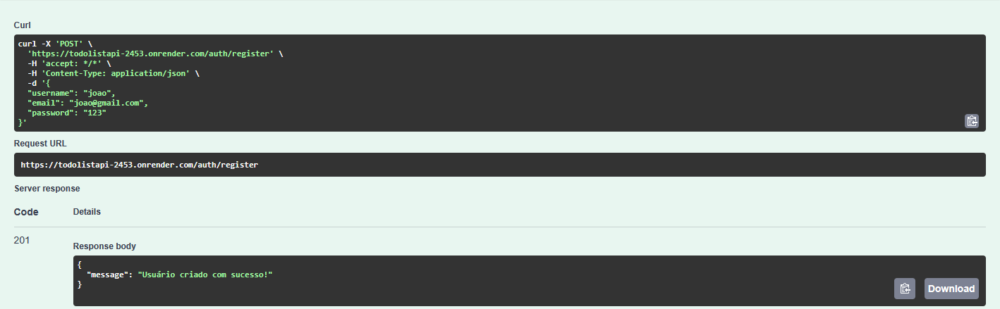
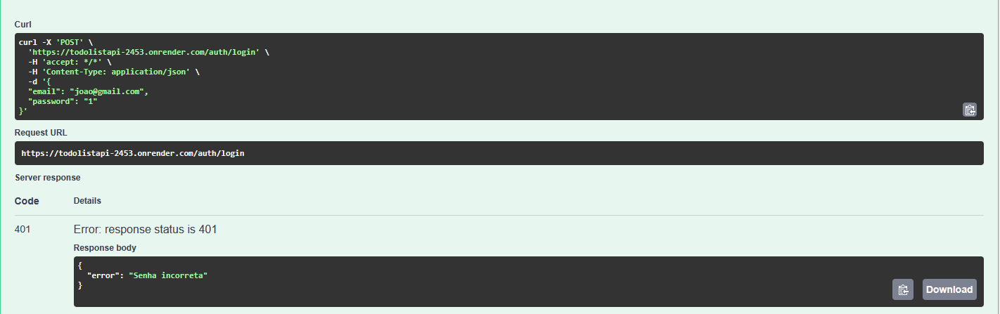
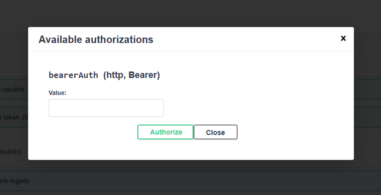

# 🧠 Projeto: API de Lista de Tarefas com Autenticação

API RESTful completa para gerenciamento de tarefas, onde cada usuário pode criar uma conta, fazer login e manipular **suas próprias tarefas**. Desenvolvido com foco em boas práticas e autenticação via JWT.

---

## 🚀 Tecnologias Utilizadas

- ⚙️ **Node.js** + **Express**
- 🛢️ **MongoDB** + Mongoose
- 🔐 **JWT** (autenticação)
- 🔒 **Bcrypt** (criptografia de senhas)
- 📄 **Swagger** (documentação da API)

---

## 🎯 Funcionalidades

- 👤 Registro de usuário
- 🔑 Login com geração de token JWT
- 🧾 CRUD de tarefas por usuário logado
- 🧠 Middleware para proteger rotas privadas
- 📘 Documentação da API via Swagger

---

## 📸 Visual do Projeto





---

## 🛠️ Como rodar localmente

### 1. Clone o repositório

```bash
git clone https://github.com/Sady09/TodoListAPI.git
cd TodoListAPI
```

### 2. Instale as dependências

```bash
npm install
```

### 3. Configure as variáveis de ambiente

Crie um arquivo `.env` com base no `.env.example`:

```env
PORT=3333
JWT_SECRET=sua_chave_jwt
MONGO_URI=seu_localhost_mongodb
```

### 4. Execute o projeto

```bash
npm run dev  # Para desenvolvimento
# ou
npm start    # Para produção
```

---

## 🔐 Rotas protegidas

As rotas de tarefas (`/tasks`) exigem autenticação.  
Use o token JWT gerado no login no campo **Authorize** do Swagger.



---

## 📄 Documentação da API (Swagger)

Acesse e teste os endpoints direto no navegador:  
🔗 **[Abrir documentação](https://todolistapi-2453.onrender.com/)**

---

## 🌐 Deploy

O projeto está hospedado gratuitamente no **Render**.  
A primeira requisição pode demorar alguns segundos devido à hibernação.

🔗 **https://todolistapi-2453.onrender.com/**

---

## 👤 Autor

**João Pedro**  
📍 Rio de Janeiro - Brasil  
[🔗 LinkedIn](https://www.linkedin.com/in/joao-sady)  
[🐙 GitHub](https://github.com/Sady09)

---

> Projeto criado como vitrine para apresentar habilidades em backend com Node.js e boas práticas em APIs RESTful.
